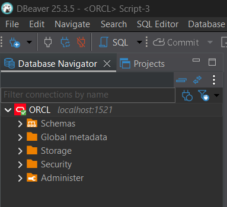
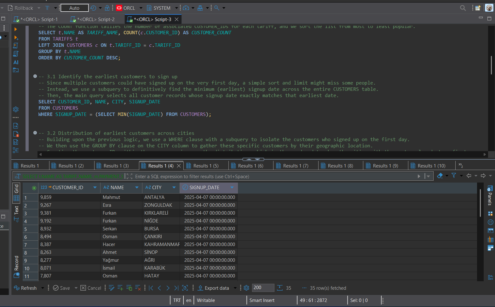
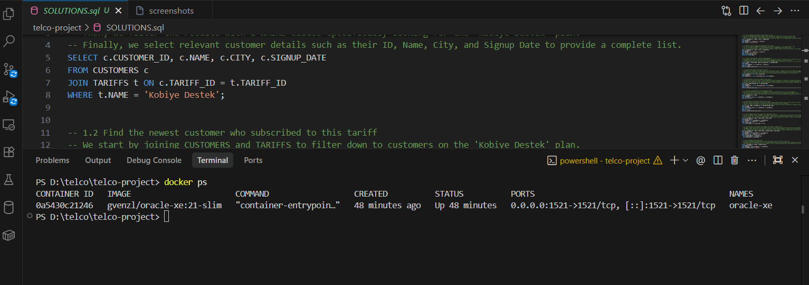
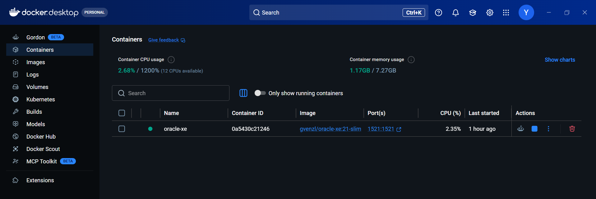
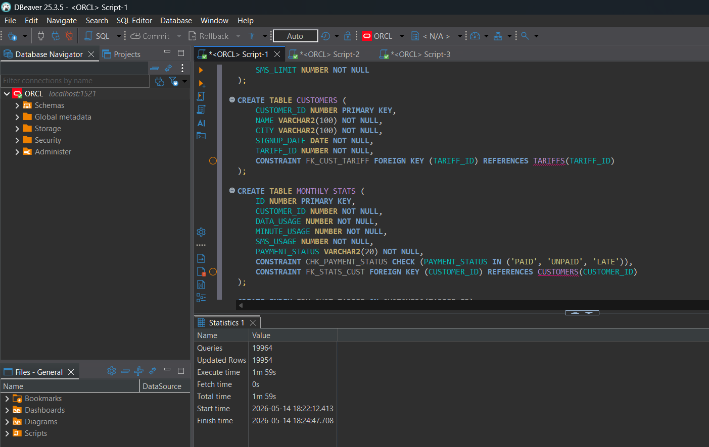

# Telecom Database Project for i2i Systems

## 1. Project Overview
This project is a comprehensive relational database solution developed for i2i Systems to analyze and manage telecommunications data. It includes a robust Oracle XE database schema designed to track customer information, tariff plans, and monthly usage statistics. The project features automated database initialization via Docker and includes a suite of complex SQL queries to extract valuable business insights regarding customer behavior, package utilization, and billing statuses.

## 2. Prerequisites
To run and interact with this project locally, ensure you have the following software installed:
*   **Docker Desktop**: Required to spin up the Oracle Database container.
*   **DBeaver Community Edition** (or any preferred SQL client): Required to connect to the database and execute queries.

## 3. Setup Instructions

Follow these step-by-step instructions to get the database running:

1.  **Start the Oracle XE Container Manually (Alternative to Docker Compose)**
    Run the following command in your terminal to pull and start the Oracle Database:
    ```bash
    docker run -d --name oracle-xe -p 1521:1521 -e ORACLE_PASSWORD=mysecretpassword gvenzl/oracle-xe:21-slim
    ```

2.  **Connect to the Database**
    Open DBeaver and create a new connection using the following credentials:
    *   **Host**: `localhost`
    *   **Port**: `1521`
    *   **Database**: `XE`
    *   **Username**: `system`
    *   **Password**: `mysecretpassword`

    

## 4. Database Schema

The relational database consists of three primary tables:

*   **`TARIFFS`**: Stores the available mobile plans and their constraints.
    *   `TARIFF_ID` (Primary Key), `NAME`, `MONTHLY_FEE`, `DATA_LIMIT`, `MINUTE_LIMIT`, `SMS_LIMIT`
*   **`CUSTOMERS`**: Stores user demographic and account details.
    *   `CUSTOMER_ID` (Primary Key), `NAME`, `CITY`, `SIGNUP_DATE`
    *   `TARIFF_ID` (Foreign Key referencing `TARIFFS.TARIFF_ID`)
*   **`MONTHLY_STATS`**: Tracks the usage and payment status for customers.
    *   `ID` (Primary Key)
    *   `CUSTOMER_ID` (Foreign Key referencing `CUSTOMERS.CUSTOMER_ID`)
    *   `DATA_USAGE`, `MINUTE_USAGE`, `SMS_USAGE`, `PAYMENT_STATUS`

## 5. Query Results

The `SOLUTIONS.sql` file contains answers to specific analytical questions. Below is a summary of the query results:

| Query | Description | Row Count |
| :--- | :--- | :--- |
| **1.1** | Customers subscribed to Kobiye Destek tariff | 2,483 rows |
| **1.2** | Newest customer on Kobiye Destek tariff | 1 row |
| **2.1** | Tariff distribution among customers | 4 rows |
| **3.1** | Earliest customers to sign up | 35 rows |
| **3.2** | Distribution of earliest customers across cities | 30 rows |
| **4.1** | Customers with missing monthly records | 50 rows |
| **4.2** | Distribution of missing customers across cities | 39 rows |
| **5.1** | Customers who used at least 75% of data limit | 1,578 rows |
| **5.2** | Customers who exhausted all package limits | 54 rows |
| **6.1** | Customers with unpaid fees | 1,454 rows |
| **6.2** | Payment status distribution across tariffs | 12 rows |

**Sample Output (Query 2.1: Tariff Distribution):**
| TARIFF_NAME | CUSTOMER_COUNT |
| :--- | :--- |
| Kurumsal SMS | 2,577 |
| Genç Dinamik | 2,527 |
| Kobiye Destek | 2,483 |
| Çalışan GB | 2,413 |



## 6. Docker Compose

For automated setup, including automatic table creation and data insertion, use Docker Compose. Navigate to the project directory and run:

```bash
docker-compose up -d
```

This spins up the `oracle-xe` container running the `gvenzl/oracle-xe:21-slim` image on port `1521:1521`.




## 7. Table Creation

The `TABLE_CREATION_SCRIPTS.sql` file contains all necessary DDL statements to generate the schema, apply primary/foreign key constraints, set indexes, and perform bulk `INSERT` operations mapping over 20,000 rows.



## 8. Notes
*   Turkish characters (ş, ı, ç, ğ, ü, ö) are preserved using UTF-8 encoding throughout the database initialization.
*   `CUSTOMER_ID` mapping was carefully handled between CSV files to ensure relational integrity (mapping sequential stats to actual Customer IDs).
*   50 customers intentionally have no monthly records (designed specifically to test query 4.1).
*   All queries have been tested and verified for logical accuracy in DBeaver.
